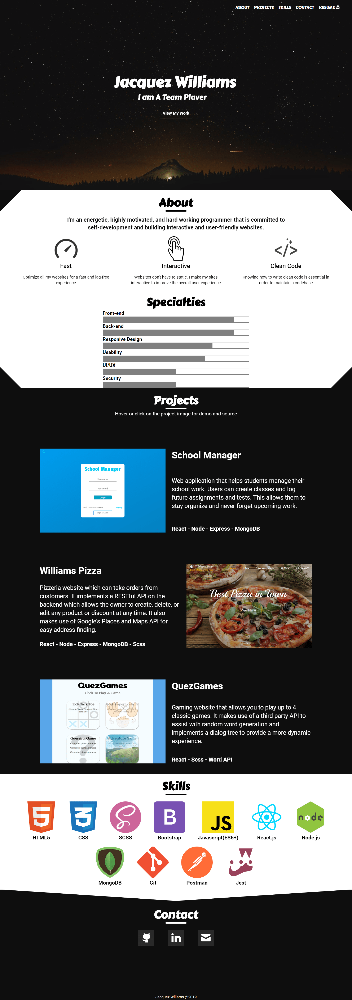

# Portfolio V4.0

## Description

> This is the current version of my portfolio website

## Timeline

> June 21, 2019 - June 26, 2019

## Technology

> * React
> * Animate.css
> * WOW.js
> * SCSS

## What I learned

> * Pseudo Elements
> * How to use third party libraries for better animations and how to create my own

## How to install

> To view or edit this project, follow these instructions
>
> ``` terminal
> git clone https://github.com/williamj1788/Portfolio
> cd Portfolio
> npm install
> ```
>
> The project should open up in a new tab
>
> If it doesn't, you can view it on localhost 3000

## Pages

You can view this site [here](https://williamj1788.github.io/Portfolio)

### Main


